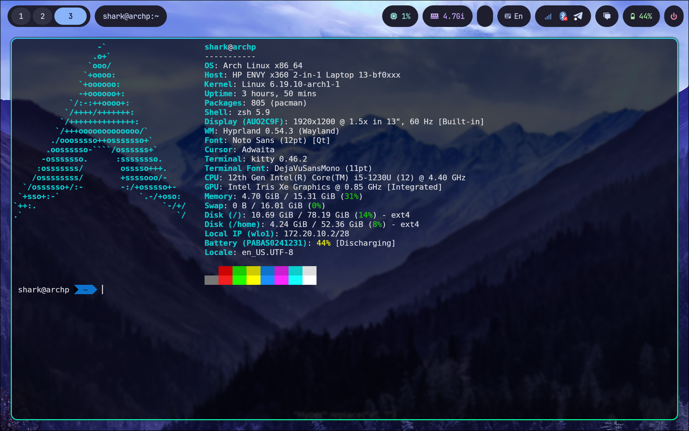

# Dotfiles Dependencies

## Core (pacman)

```bash
sudo pacman -S hyprland waybar hyprpaper hypridle hyprlock \
  kitty wofi swaync \
  pipewire wireplumber pipewire-pulse \
  brightnessctl playerctl \
  network-manager-applet blueman \
  grim slurp swappy wl-clipboard \
  qt6ct adw-gtk-theme \
  jq
```

## AUR (yay)

```bash
yay -S spotify wlogout
```

## Optional / Already Installed

| Package | Purpose |
|---|---|
| `thunar` | File manager (`$fileManager`) |
| `wofi` | App launcher (`$menu`) |
| `pavucontrol` | Audio control (pulseaudio module click) |
| `wlogout` | Power menu (`custom/power`) |
| `swappy` | Screenshot editor |
| `blueman` | Bluetooth manager (waybar click) |

## Waybar Modules & Their Dependencies

| Module | Requires |
|---|---|
| `hyprland/workspaces` | hyprland |
| `mpris` | playerctl, spotify |
| `pulseaudio` | pipewire-pulse, pavucontrol |
| `bluetooth` | blueman |
| `custom/language` | jq, hyprctl |
| `custom/notification` | swaync |
| `custom/power` | wlogout |
| `battery` | kernel battery support (built-in) |
| `clock` | — |
| `tray` | nm-applet, blueman-applet |

## Notes

- GTK3 dark theme requires `adw-gtk3` package (`adw-gtk-theme` on Arch)
- GTK4 dark theme is set via `gsettings` automatically
- Qt dark theme requires configuring `qt6ct` manually after install
- Keyboard layouts configured: `us`, `lt`, `ru` — toggle with `Alt+Shift`
